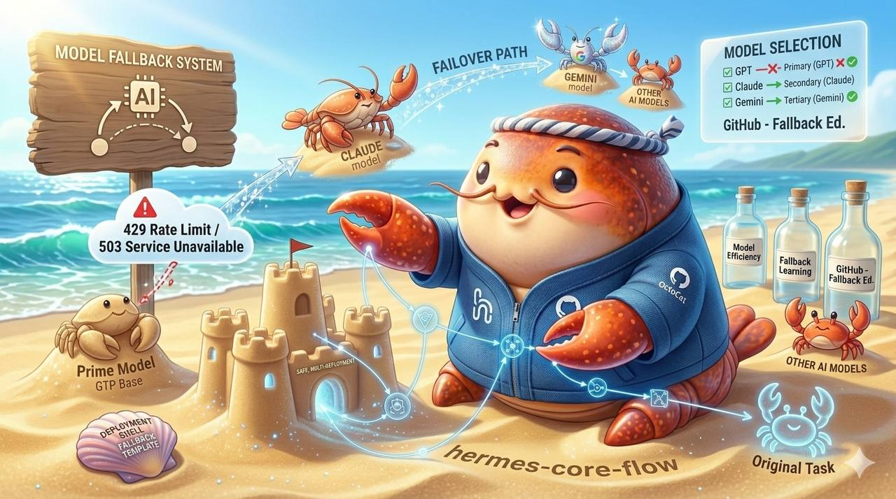

<div align="center">

# 🛡️ Hermes Model Fallback Skill



</div>


**The ultimate resilience layer for AI Agents. No more 429s, 503s, or hanging processes.**

[](https://opensource.org/licenses/MIT)
[](https://github.com/cheerhuan)
[](https://github.com/cheerhuan)

---

## 📖 Overview | 概覽

**English:**  
`hermes-model-fallback` is a cross-platform skill designed to prevent AI Agents from freezing or crashing when a primary LLM provider fails. It implements a smart failover mechanism that automatically switches to backup models upon encountering rate limits (HTTP 429), server errors (HTTP 503), or timeouts.

**中文：**  
`hermes-model-fallback` 是一個跨平台的技能模組，旨在防止 AI Agent 在主模型失效時發生凍結或崩潰。它實作了一套智能故障轉移機制，當偵測到頻率限制 (HTTP 429)、伺服器錯誤 (HTTP 503) 或超時時，會自動切換至備用模型。

---

## ✨ Key Features | 核心功能

- 🔁 **Smart Auto-Retry** | **智能重試**: Retries the same model (default 2x) before switching to avoid transient hiccups.
- ⚡ **Instant Failover** | **極速轉移**: Switches to the next model in the priority list immediately after exhaustion.
- ⏱️ **Timeout Shield** | **超時保護**: Prevents agents from hanging indefinitely on slow API responses.
- 🌐 **Multi-Provider Support** | **多提供者支援**: Gemini, OpenAI, Claude, Mistral, Groq, and local Ollama.
- 🔑 **Env Var Security** | **環境變數安全**: Supports `ENV:VAR_NAME` to keep your API keys out of the config files.
- 🐍 **Cross-Language** | **跨語言支援**: Ready-to-use Python and JavaScript clients.

---

## 🚀 Quick Start | 快速上手

### 1. Configuration | 配置
Edit `scripts/config.json` to define your model priority:

```json
{
  "models": [
    { "provider": "gemini", "model": "gemini-1.5-pro", "api_key": "ENV:GEMINI_KEY" },
    { "provider": "openai", "model": "gpt-4o", "api_key": "ENV:OPENAI_KEY" },
    { "provider": "ollama", "model": "llama3", "api_key": "" }
  ],
  "retry_limit": 2,
  "timeout_seconds": 30
}
```

### 2. Usage | 使用

**Python:**
```python
from scripts.fallback_client import FallbackClient
client = FallbackClient("scripts/config.json")
print(client.chat("Hello world!"))
```

**JavaScript:**
```javascript
const { FallbackClient } = require('./scripts/fallbackClient');
const client = new FallbackClient('./scripts/config.json');
client.chat("Hello world!").then(console.log);
```

---


---

## 🛠️ Agent Installation | Agent 安裝指南

This skill is optimized for **Hermes Agent** and **OpenClaw**. To internalize this skill into your agent's memory:

**English:**
1. **Clone the repository** into your agent's skills directory:
   ```bash
   git clone https://github.com/cheerhuan/hermes-model-fallback.git ~/.hermes/skills/hermes-model-fallback
   ```
2. **Configure your API keys** in `~/.hermes/skills/hermes-model-fallback/scripts/config.json`.
3. **Restart the Agent** or trigger a skill reload. The agent will now automatically use this failover logic when it encounters API errors.

**中文：**
將此技能內化至 **Hermes Agent** 或 **OpenClaw** 的操作步驟：
1. **克隆儲存庫** 至 Agent 的技能目錄：
   ```bash
   git clone https://github.com/cheerhuan/hermes-model-fallback.git ~/.hermes/skills/hermes-model-fallback
   ```
2. **配置 API 金鑰**：編輯 `~/.hermes/skills/hermes-model-fallback/scripts/config.json`。
3. **重啟 Agent** 或觸發技能重新載入。之後 Agent 在遇到 API 錯誤時將自動執行此故障轉移邏輯。


## 📁 Structure | 結構

```text
hermes-model-fallback/
├── SKILL.md              # Agent definition (Hermes/OpenClaw)
├── README.md             # Documentation
├── scripts/
│   ├── config.json       # Model list & Keys
│   ├── fallback_client.py# Python Implementation
│   └── fallbackClient.js # JS Implementation
└── references/
    ├── add-provider.md   # How to add new providers
    └── troubleshooting.md# Common fixes
```

---

## 📄 License | 授權
MIT License. Feel free to use, modify, and distribute.
